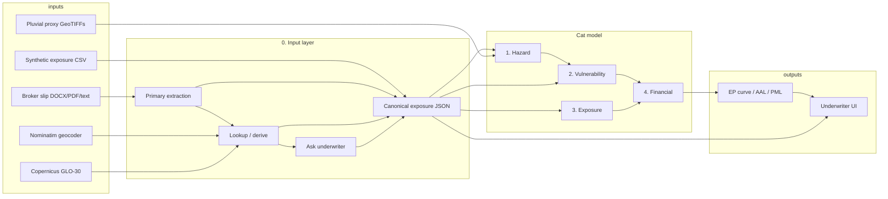

# System architecture

Nairobi flood catastrophe model (Team A). Design only — no runtime yet.

## Purpose

Give a Kenya Re underwriter, in under two minutes:

- a defensible **ground-up and gross loss** for a flood of stated rarity
- an **EP curve** (loss vs return period)
- a breakdown by construction class
- a parsed **facultative risk** from a messy broker PDF/DOCX
- honest labels for what is real data vs proxy vs assumption vs synthetic

Stakeholders: underwriters, portfolio/exposure managers, hackathon judges, later cedants/brokers.

## High-level architecture



Industry analogues: Continuuiti’s four modules (hazard, vulnerability, exposure, financial); JRC Huizinga depth-damage for non-US buildings; Oasis LMF for AAL/EP maths. We do not license HAZUS US replacement costs as Kenyan TIV.

## Module 0 — Input layer (smart ingestion)

Required AI differentiator. Materially changes the input to the engine.

**Waterfall (graceful degradation, not silent invention):**

1. **Extract** from the slip (NLP / regex): GPS, elevation, construction wording, floors, height, basements, GFA, TIV, coverage type, deductibles, limits.
2. **Derive / look up:** geocode address; DEM if elevation missing; `floors × 3.5 m` if height missing; `area × cost` if TIV missing; class table if cost/m² missing.
3. **Labelled default:** basement `0`; limit = TIV; synthetic deductible `0`.
4. **Ask the human** only if the run is blocked (no GPS after geocode; no way to value; construction line missing and nothing to infer).

Every field carries `source`: `extracted | geocoded | dem | implied | class_default | human`.

GPS is the only field that must never be defaulted. Wrong coordinates shift flood loss by tens of percent.

Canonical schema, coverage type, and construction mapping: [INTAKE.md](INTAKE.md).

## Module 1 — Hazard

**Question:** where does it flood, and how severe?

**Nairobi inputs**

- Five GeoTIFFs: `nairobi_pluvial_proxy_{common,occasional,moderate,severe,extreme}.tif`
- Cell value: susceptibility **0–1**, not depth in metres
- Blend (kit): basin elevation 45%, local depression 20%, OSM river distance 20%, slope/flatness 15%
- Fast path: scores already on `exposure_nairobi_with_hazard.csv`

**Tier → assumed return period** (kit reference; state if we change it)

| Tier | Cells kept | Buildings wet (of 600) | Assumed RP | AEP |
|---|---|---|---|---|
| extreme | top 5% | 32 | 10 y | 10% |
| severe | top 10% | 51 | 25 y | 4% |
| moderate | top 20% | 110 | 50 y | 2% |
| occasional | top 30% | 174 | 100 y | 1% |
| common | top 40% | 259 | 250 y | 0.4% |

Loss must **rise** as the event gets rarer (common is the wide, rare map).

**Score → damage:** either map score → assumed depth (e.g. 1.0 = 4 m) then JRC, or feed score into a class-specific saturating/sigmoid curve. Decision lives in vulnerability, stated once.

**Validation:** `nairobi_hotspots_geocoded.csv`. Report hit rate in plain language. Do not treat river-gorge elevation difference as a pluvial discount.

## Module 2 — Vulnerability

**Question:** given severity and construction class, what fraction of value is destroyed?

Four curves, one per `housing_class`. Shape: near-zero at low severity, steep in the middle, ceiling **80–95%** (land/foundation survive). Informal iron-sheet damages early; `concrete_rcc` later.

Reference: JRC Huizinga 2017 Africa (e.g. ~40% at 1 m for continental residential). Adapt parameters; do not paste US HAZUS ratios as Kenya truth.

Parser does **not** invent `K`, `S₀`, `k`. It only selects the class. Curve parameters are fitted in this module.

**Towers:** do not use flood depth / building height as the whole-building damage ratio. Use [wet-storey area](VALUATION.md) plus basement plant surcharge when `critical_plant_in_basement` is true.

## Module 3 — Exposure

**Question:** what sits on the map, and what is it worth?

Two feeds, never silently mixed:

1. **Synthetic book** — 600 rows, `synthetic=True`, structure TIV only.
2. **Parsed facultative risk** — Landmark Plaza JSON (and later other slips).

Valuation basis: **replacement cost new in KES**, not market price, not land, not book value. Declared TIV wins over `area × cost`. See [VALUATION.md](VALUATION.md).

## Module 4 — Financial

Per building, per rarity tier:

```
ground_up = damage_ratio × insured_value_of_wet_subject
gross     = min(max(ground_up − deductible, 0), limit)
deductible = max(deductible_pct × ground_up, deductible_min_kes)   # unless clause says "% of TIV"
```

`insured_value_of_wet_subject` depends on coverage subject (building, assets, or both) and on which storeys are wet.

Optional demo: quota share (e.g. 25%) → ceded / net. Cat XL layers are out of scope.

**Outputs**

| Metric | Meaning |
|---|---|
| Ground-up | Physical damage before policy terms |
| Gross | After deductible and limit |
| EP curve | Loss vs return period (or vs the five tiers) |
| AAL | Discrete integral of the five EP points (stated as approximate) |
| PML | Loss at 100-year and 250-year (occasional / common under the reference mapping) |
| Class split | Loss and TIV by housing class |

## User interface

Continuuiti-style, readable in two minutes:

- Input summary with **source tags** on every field
- Methodology (proxy vs measured, synthetic vs parsed, JRC adaptation)
- Damage ratio; structure vs contents if subject is both
- Map of wet buildings / the facultative pin
- EP chart (loss increases toward `common` / 250-year)
- Loud **synthetic / proxy** labelling, not a footnote

## What must never happen

- Present the 600-row file as a real Kenya Re portfolio
- Call the 0–1 rasters measured flood depth
- Default GPS
- Auto-apply Landmark’s 5% / KES 5M deductible to the synthetic book
- Apply a single-storey damage ratio to 18 floors of TIV
- Down-weight Nairobi hazard because the river sits in a gorge
- Run a loss with no coordinates and no pin

## Build order (when coding is approved)

1. Canonical JSON schema + Landmark fixture (expected parse)
2. Document parser (DOCX/PDF/text) with source tags
3. Geocode + DEM lookup
4. Hazard sample (CSV first, rasters optional)
5. Four vulnerability curves + wet-floor split
6. Financial engine + EP
7. Underwriter UI + “ask human” blockers
